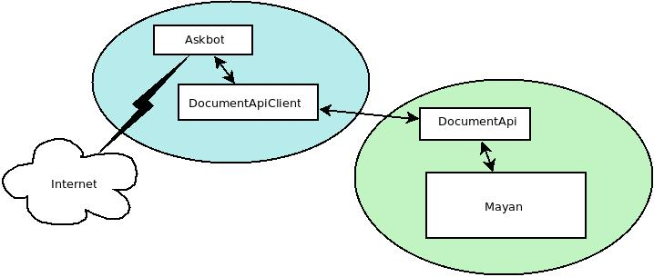

.. _pyro-api:

Pyro API installation and setup
===============================

version draft 8, Feb 2013

*by Mgr. Martin Kubát (martin.kubat@coex.cz)*

This document describe how install and set Pyro API between Mayan EDMS and Pluto project.

Pyro API (DocumentAPI) is Pyro (http://packages.python.org/Pyro4/) implementation of document server interface for communication with Mayan system.

Note:
^^^^^

Pyro is not the best way to copy files over network. But - by ours experiences worked allways good. If there will be any problems, is necessary to rewrite a bit of code for moving files with better tools (scp, wget, rsync, ...).
More informations: http://packages.python.org/Pyro4/tipstricks.html#binary-data-transfer

Servers structure:
------------------

How to install?
---------------
::

    # open ssh shell on mayan server
    # switch to your env (source bin/activate)
    pip install Pyro4

    # connect to Mayan
    # clone application mayan_pyro_api. For example to path /srv/mayan/cgi-bin/
    git clone git@git.coex.cz:mayan_pyro_api.git
    # this create dir /srv/mayan/cgi-bin/mayan_pyro_api

    # create modules symlink
    cd /srv/mayan/cgi-bin/mayan/modules
    ln -s /srv/mayan/cgi-bin/mayan_pyro_api/pyro_api/

    # and add app to INSTALLED_APPS in settings.py
    cd /srv/mayan/cgi-bin/mayan/
    nano settings.py
    INSTALLED_APPS = (
       # ...
       "pyro_api",
       # …
    )

How to set?
-----------

All settings must be on both site same (client-server).

Documentation: http://packages.python.org/Pyro4/servercode.html#creating-a-daemon

file /srv/mayan/cgi-bin/mayan_pyro_api/pyro_api/setting_local.py::

    # mayan server IP
    SERVER_IP = "192.168.1.1"

    # SECRET key, random hash
    HMAC_KEY = "sd1fg86ds4f6sd8hg4sd6fg68sdf746g4"

    # SECRET id, random hash
    URI_ID = "1sadfasfg468h7j9g7j9h78gk6g54fg6f"

    # mayan port, example.
    URI_PORT = 33333

Security notes
--------------

``HMAC_KEY`` and ``URI_ID`` and is auth data for connect to DocumentAPI. It will be nice, when is sometimes changed. Hold it in confidentiality!

When you will use Mayan application opened to wild internet - use firewall for filtering ports on Document server and enable URI_PORT only for specific IP address.

Running Pyro API
^^^^^^^^^^^^^^^^

Application contains django command “run_api”. You can run it with ./manage run_api command. It will be nice to add this command to supervisor setup::

    [program:pyro_api]
    command=/srv/mayan/cgi-bin/env/bin/python manage.py run_api
    directory=/srv/mayan/cgi-bin/mayan/
    autostart = true
    autorestart=true
    user=mayan

Note: change paths if you need and add pyro_api to group programs.

Client example
^^^^^^^^^^^^^^
::

    # -*- coding: utf-8 -*-
    import os
    import Pyro4
    from uuid import uuid4
    from settings import *

    HMAC_KEY = "top-secret-hash"
    URI_ID = "top-secret-hash"
    SERVER_IP = "192.168.23.7"
    URI_PORT = 12345

    ################################################################################

    Pyro4.config.HMAC_KEY = HMAC_KEY
    Pyro4.config.HOST = SERVER_IP

    ################################################################################

    class PlutoClient(object):
        """
           DocumentAPI client
        """

        def __init__(self):
            """
            connect to remote document-parser server
            """
            self.uri = "PYRO:%s@%s:%s" % (URI_ID, SERVER_IP, URI_PORT)
            self.api = Pyro4.Proxy(self.uri)

        def retrive_thumbnails_wrapper(self, uuid, path):
            """
            wrapper for retrive document thumbnails
            """

            pages_count = self.api.get_page_count(uuid)
            for page in xrange(1, pages_count + 1):
                file_path = os.path.join(path, "%s_%s" % (uuid, page))
                img = self.api.retrive_thumbnails(uuid, page=page)
                f_loc = open(file_path, "w")
                f_loc.write(img)
                f_loc.close()

    pluto_client = PlutoClient()

    #######################################
    # upload document example
    #######################################

    uuid_example = "47d6daa5-e2ef-4a17-be87-9c339d06120a"
    status = pluto_client.api.upload_document(
        open("/path/to/file", "r").read(),
        uuid_example
    )

    print status

    # example:
    # >> {'document_id': 116, 'uuid': '47d6daa5-e2ef-4a17-be87-9c339d06120a', 'success': True, 'pages': 15}

    #######################################
    # retrive text example
    #######################################

    pluto_client.api.retrive_plaintext(uuid_example)
    # >> return document text reprezentation

    #######################################
    # retrive document thumbnail example
    #######################################

    files_path = "/tmp"
    pluto_client.retrive_thumbnails_wrapper(uuid_example, files_path)
    # >> store files to files_path

